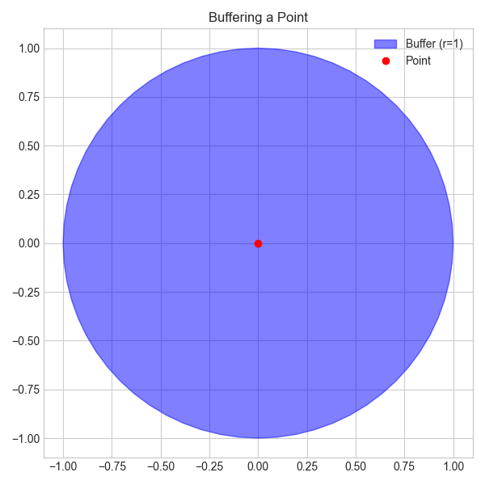
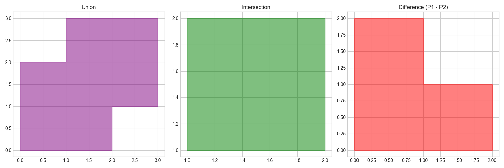
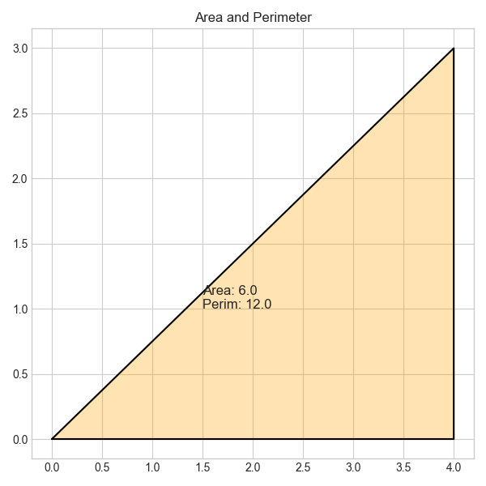
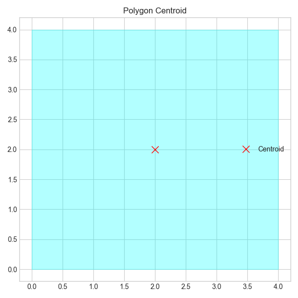
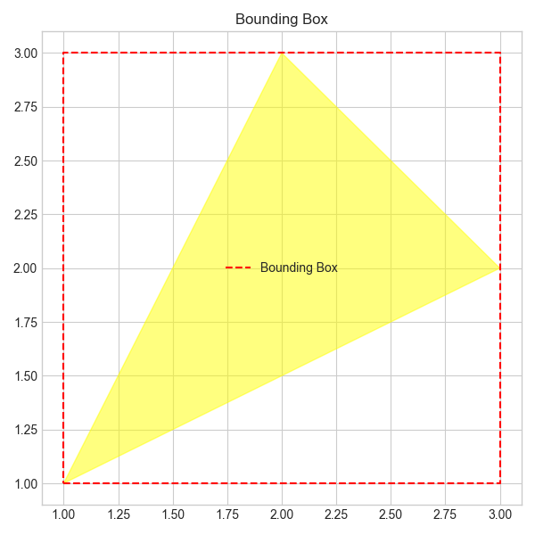
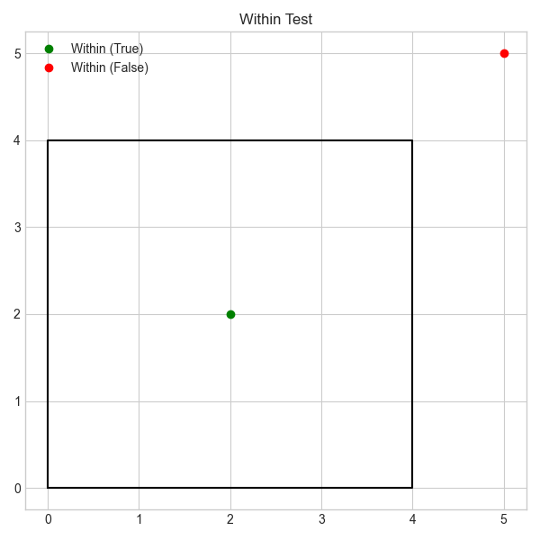
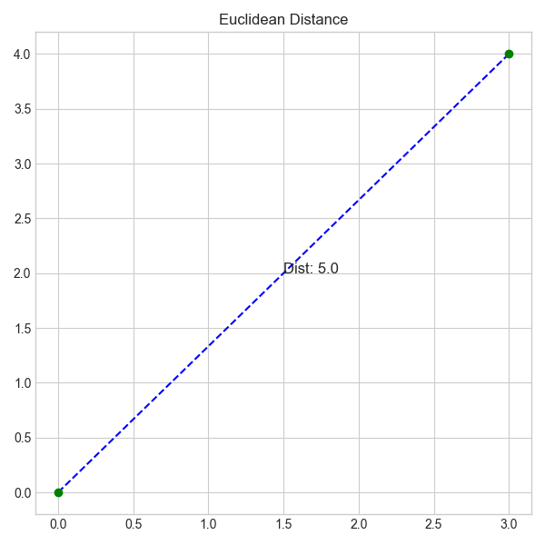
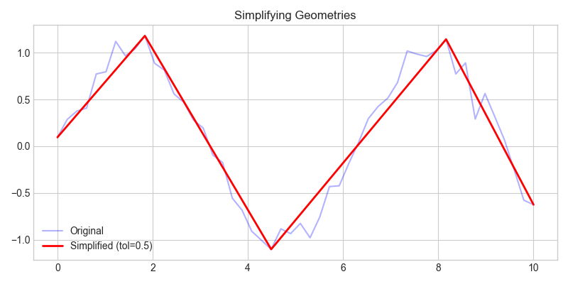
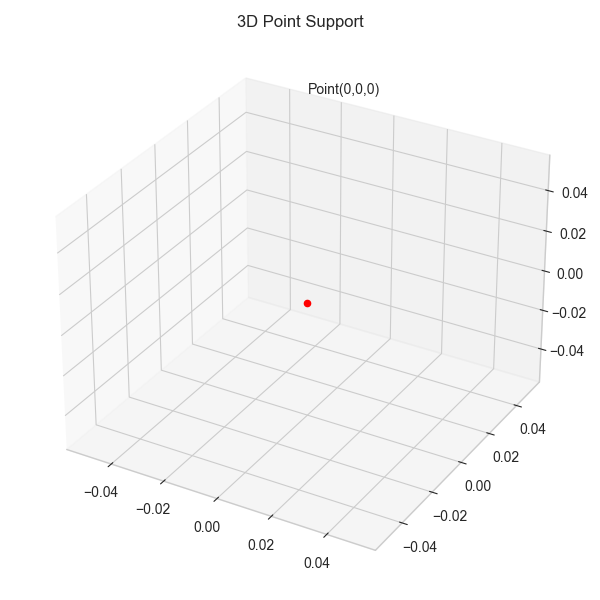

# Geo Data Science BR - GDSBR

### **DESCRIÇÃO:** _Projetos de Geotecnologia que envolvem Análise de Dados, Machine Learning e Engenharia de Software com uso de agentes de IA para acelerar o aprendizado e o desenvolvimento dos projetos_

### **OBJETIVO:** _Divulgar o uso de Python para Análise de Dados e Machine Learning em projetos de Geotecnologia com auxílio de Agentes de IA e uso de tecnologias modernas._

### **PÚBLICO:** _Estudantes, profissionais e entusiastas de Geoprocessamento e Geografia que não sabem programar e que queiram iniciar em programação com linguagem Python para construir projetos de Geotecnologia com as ferramentas mais modernas e aplicadas no Mercado de Trabalho de TI._

## PROJETO 1: INTRODUÇÃO À GEOMETRIAS

### 1. Criando um Ponto (Creating a Point)

**Explicação:**
Um ponto geométrico (`Point`) representa uma única localização no espaço, definida por coordenadas numéricas (longitude e latitude). Na biblioteca **Shapely**, pontos podem ser criados passando as coordenadas `(x, y)` ou `(longitude, latitude)`, e são a base para construir outras geometrias.

**Código:**
```python
from shapely.geometry import Point
import matplotlib.pyplot as plt

# Criando um ponto (Longitude, Latitude)
# Exemplo: Brasília, DF
# Longitude = x = -47.8825
# Latitude  = y = -15.7942
ponto = Point(-47.8825, -15.7942)

print(f"Ponto criado: {ponto}")
# Saída: POINT (-47.8825 -15.7942)
```

**Resultado:**


---
### 2. Criando Linhas (Creating Line Segments)

**Explicação:**

Uma linha (`LineString`) é uma sequência de pelo menos dois pontos conectados. Representa objetos lineares como ruas, rios ou limites. Em `shapely`, é criada a partir de uma lista de coordenadas `(x, y)` ou pontos.

**Código:**
```python
from shapely.geometry import LineString

# Criando uma linha com 2 pontos (Ponta A -> Ponta B)
line = LineString([(-47.9500, -15.7900), (-47.8200, -15.8000)])

print(f"Linha criada: {line}")
```

**Resultado:**


---
### 3. Criando Polígonos e Multipolígonos (Creating Polygons and Multipolygons)

**Explicação:**

- **Polígono (`Polygon`)**: Uma área fechada definida por uma borda externa (shell) e opcionalmente bordas internas (holes). O primeiro e o último ponto da sequência devem ser iguais para fechar o anel (ou o Shapely fecha automaticamente).
- **Multipolígono (`MultiPolygon`)**: Uma coleção de um ou mais polígonos tratados como um único objeto geométrico (ex: um arquipélago, ou um país com ilhas).

**Código:**
```python
from shapely.geometry import Polygon, MultiPolygon

# Criando um Polígono (Triângulo)
poly = Polygon([
    (-47.8500, -15.8200),
    (-47.8000, -15.8200),
    (-47.8250, -15.8500)
])

# Criando um Multipolígono (Dois quadrados desconexos)
mpoly = MultiPolygon([
    Polygon([(0,0), (1,0), (1,1), (0,1)]),
    Polygon([(2,2), (3,2), (3,3), (2,3)])
])

print(f"Polígono: {poly}")
print(f"Multipolígono: {mpoly}")
```

**Resultado:**


---
### 4. Buffer (Buffering a Geometry)

**Explicação:**
O buffer cria uma nova geometria que representa todos os pontos dentro de uma determinada distância da geometria original. É muito usado para zonas de influência.

**Código:**
```python
from shapely.geometry import Point

p = Point(0, 0)
buffer_geom = p.buffer(1.0) # Buffer circular de raio 1

print(buffer_geom.area) # Aprox pi * r^2
```

**Resultado:**


### 5. Operações de Conjunto (Set Operations on Geometries)

**Explicação:**
O Shapely permite realizar operações da teoria dos conjuntos entre geometrias, como União, Interseção e Diferença.

**Código:**
```python
from shapely.geometry import Polygon

p1 = Polygon([(0,0), (2,0), (2,2), (0,2)])
p2 = Polygon([(1,1), (3,1), (3,3), (1,3)])

uniao = p1.union(p2)
interseccao = p1.intersection(p2)
diferenca = p1.difference(p2)
```

**Resultado:**


### 6. Área e Perímetro (Area and Perimeter Computation)

**Explicação:**
Geometrias como Polígonos possuem propriedades diretas para calcular área (`.area`) e perímetro (`.length`).

**Código:**
```python
from shapely.geometry import Polygon

# Triângulo retângulo 3-4-5
poly = Polygon([(0,0), (4,0), (4,3)])

print(f"Área: {poly.area}") # 6.0
print(f"Perímetro: {poly.length}") # 12.0
```

**Resultado:**


### 7. Calculando Centróides (Computing Centroids)

**Explicação:**
O centróide é o centro geométrico de uma figura plana. É um ponto que representa a média aritmética de todos os pontos da forma.

**Código:**
```python
from shapely.geometry import Polygon

poly = Polygon([(0,0), (4,0), (4,4), (0,4)])
centroid = poly.centroid

print(f"Centróide: {centroid}") # POINT (2 2)
```

**Resultado:**


### 8. Polígono Envolvente (Enclosing Polygons)

**Explicação:**
Uma operação comum é encontrar o menor polígono convexo que envolve um conjunto de pontos (Convex Hull).

**Código:**
```python
from shapely.geometry import MultiPoint

points = MultiPoint([(0,0), (1,3), (2,2), (4,1), (3,0), (-1,1)])
hull = points.convex_hull
```

**Resultado:**


### 9. Criando uma Bounding Box (Creating a Bounding Box)

**Explicação:**
O *Bounding Box* (Envelope) é o menor retângulo alinhado aos eixos x e y que contém a geometria inteira.

**Código:**
```python
from shapely.geometry import Polygon

poly = Polygon([(1,1), (2,3), (3,2)])
minx, miny, maxx, maxy = poly.bounds

bbox = Polygon([(minx, miny), (maxx, miny), (maxx, maxy), (minx, maxy)])
```

**Resultado:**


### 10. Teste "Contém/Dentro" (Within-test)

**Explicação:**
Verifica se uma geometria está totalmente dentro de outra (`within`) ou contém outra (`contains`).

**Código:**
```python
from shapely.geometry import Point, Polygon

poly = Polygon([(0,0), (4,0), (4,4), (0,4)])
p_in = Point(2, 2)

print(p_in.within(poly))  # True
```

**Resultado:**


### 11. Cálculo de Distância (Distance Calculation)

**Explicação:**
Calcula a menor distância Euclidiana (em linha reta) entre duas geometrias.

**Código:**
```python
from shapely.geometry import Point

p1 = Point(0, 0)
p2 = Point(3, 4)
dist = p1.distance(p2) # 5.0
```

**Resultado:**


### 12. Simplificando Geometrias (Simplifying Geometries)

**Explicação:**
Reduz o número de vértices de uma geometria mantendo sua forma geral, usando algoritmos como Douglas-Peucker.

**Código:**
```python
from shapely.geometry import LineString

line = LineString([(0,0), (1,0.1), (2,-0.1), (3,0), (4,0)])
simplified = line.simplify(tolerance=0.2, preserve_topology=False)
```

**Resultado:**


### 13. Objetos 3D (3D Objects in Shapely)

**Explicação:**
O Shapely suporta coordenadas Z, mas a maioria das operações espaciais considera apenas o plano 2D.

**Código:**
```python
from shapely.geometry import Point

p3d = Point(1, 2, 3)
print(p3d.has_z) # True
```

**Resultado:**


## PROJETO 2: VECTOR DATA IN PYTHON
### 14. Querying the Built-in Datasets in GeoPandas
### 15. Parsing a Data File into a GeoDataFrame
### 16. Creating a GeoDataFrame from Scratch
### 17. Creating a GeoDataFrame from a DataFrame
### 18. Writing a GeoDataFrame to a File
### 19. Accessing the Geometry Column as a GeoSeries
### 20. Bounds of a GeoSeries
### 21. Area and Perimeter Computation
### 22. Simple Visualization with GeoPandas
### 23. Buffering a GeoDataFrame
### 24. Spatial Join with GeoPandas
### 25. Overlaying GeoDataFrames
### 26. Dissolving Polygons
### 27. Splitting Geometries in a GeoDataFrame
### 28. Applying Simple Functions on GeoDataFrames
### 29. Generating Random Synthetic Data
### 30. Counting Points in Polygons


## PROJETO 3: VISUALIZING GEOSPATIAL DATA
### 31. Using Matplotlib for Categorical Coloring in Geospatial Data
### 32. Using Matplotlib for Continuous Value Coloring with Linear Scale
### 33. Using Matplotlib for Continuous Value Coloring with Logarithmic Scale
### 34. Visualizing Multiple GeoDataFrames
### 35. Creating a Heatmap from Point Data
### 36. Adding Basemap with Contextily
### 37. Creating a Simple Interactive Map with Folium
### 38. Creating a Simple Interactive Map with Plotly
### 39. Visualizing 3D Geometries with Matplotlib
### 40. Visualizing 3D Geometries with Pydeck


## PROJETO 4: MAP PROJECTIONS
### 41. Querying Coordinate Reference Systems
### 42. Setting the Default CRS
### 43. Reprojecting a GeoDataFrame
### 44. Understanding Global vs. Local CRS
### 45. Additional Projection Systems
### 46. Transforming Coordinates Directly
### 47. Obtaining EPSG Codes


## PROJETO 5: SPATIAL INDEXING
### 48. Creating a Simple Spatial Index in GeoPandas
### 49. Using Simple Spatial Indexes for Efficient Queries
### 50. Efficient Spatial Indexing with RTree
### 51. Creating a Square Grid from Scratch
### 52. Visualizing RTree Indexing
### 53. Enclosing Grid Cell Identification Using RTree
### 54. Introduction to H3 Indexing
### 55. Visualizing H3 Grids


## PROJETO 6: GEOCODING
### 56. Geocoding a Single Address Using GeoPy
### 57. Reverse Geocoding Coordinates
### 58. Batch Geocoding Multiple Addresses
### 59. Handling Missing Geocodes
### 60. From Geocoding to GeoDataFrame
### 61. Geocoding within a DataFrame


## PROJETO 7: RASTER DATA IN PYTHON
### 62. Reading Raster Data
### 63. Clip the raster data file using GeoPandas
### 64. Writing Raster Data
### 65. Visualizing Raster Data
### 66. Histogram Equalization on Raster Data
### 67. Applying Simple Functions on Raster Data
### 68. Reprojecting Raster Data
### 69. Compute Zonal Statistics
### 70. Convert a Raster Grid into Vector Data
### 71. Reading Large Raster Files Efficiently
### 72. Clipping Large Raster Files
### 73. Visualizing Large Raster Files
### 74. Downsampling a Large Raster File


## PROJETO 8: INTRODUCTION TO OPENSTREETMAP DATA
### 75. Downloading Administrative Areas from OpenStreetMap (OSM)
### 76. Using OSMnx to Download Points of Interest (POIs)
### 77. Using OSMnx to Download Parks as Polygons
### 78. Using OSMnx to Download Building Footprints
### 79. Using OSMnx to Download Road Networks
### 80. Visualizing Complex Urban Areas


## PROJETO 9: SPATIAL NETWORKS
### 81. Road Networks in GeoPandas
### 82. From GeoDataFrames to Spatial Networks
### 83. Visualizing Spatial Networks
### 84. Calculating the Shortest Path
### 85. Visualizing the Shortest Path
### 86. Generating Walking Distance Isochrones
### 87. Obtaining spatial network statistics
### 88. Network Centrality Measures
### 89. Community Detection in Spatial Networks

## PROJETO 10: GEOSPATIAL STATISCS AND MACHINE LEARNING
### 90. Descriptive Statistics with GeoPandas
### 91. Global Spatial Autocorrelation
### 92. Local Spatial Autocorrelation
### 93. Spatial Feature Generation
### 94. OLS Regression on Spatial Data
### 95. Spatial Regression Models
### 96. Spatial Random Forest
### 97. Comparing Spatial Regression Models
### 98. Hotspot Analysis
### 99. Kernel Density Estimation
### 100. Inverse Distance Weighting for Spatial Interpolation
### 101. Spatial Clustering